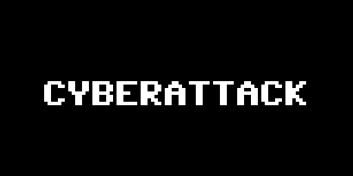

Game made for Game Off 2021 game jam, theme Bug.

A company's distributed network is under attack by waves of viruses that's been leaked through bugs within the system. Your job is to stop these waves of attacks and protect from the network from getting compromised.

The inspiration for this game came from the idea of IoT (internet of things) devices being hacked through vulnerabilities. Simplified the initial idea and abstracted to how it currently is today.

## Game controls:

Movement: W,A,S,D

Shoot: Left mouse button

## Project details

Game is made in Godot 3.4.0

All files are here and are ready to use if you wish to open this project on your own computer. However, code base is terribly messy and undocumented. Open this project in Godot 3.4 and it's ready to roll, no scripts or any setup required.

## Game page

Game can be downloaded and viewed here [https://3chooks.itch.io/cyberattack](https://3chooks.itch.io/cyberattack)